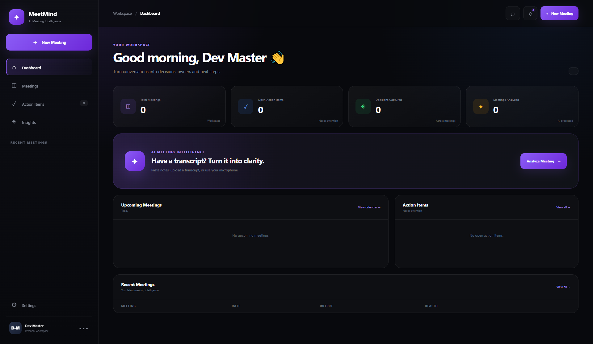

<div align="center">

# 🧠 MeetMind Pro

### AI Meeting Intelligence Workspace

Transform conversations into summaries, decisions, and actionable tasks.

<br/>


</div>

## ✨ Features

### 🧠 Meeting Intelligence

- Meeting transcript analysis
- Automatic meeting summaries
- Action item detection
- Decision extraction
- Deadline detection
- Follow-up detection
- Question extraction
- Participant detection
- Meeting health scoring

### 🎙️ Voice Meeting Capture

- Browser-based speech recognition
- Live transcript generation
- Recording timer
- Microphone status
- Continuous speech recognition where supported

### 📋 Action Items

- Automatically extract tasks from meetings
- Create tasks manually
- Assign task owners
- Add deadlines
- Complete and reopen tasks
- Delete tasks
- Separate due-today, upcoming and completed tasks

### 📊 Meeting Analytics

Track important meeting metrics including:

- Total meetings
- Open action items
- Decisions captured
- Meetings analyzed
- Average meeting health
- Decisions per meeting
- Meeting outcome insights

### 💾 Local Workspace

MeetMind Pro currently stores workspace data directly in the browser.

- Meeting history
- Action items
- User settings
- Local persistence
- JSON workspace export
- Local data reset

### 📁 Transcript Import

Import meeting transcripts from:

- `.txt`
- `.md`
- `.csv`
- `.json`

### 📱 Responsive Interface

The application is designed for:

- Desktop
- Laptop
- Tablet
- Mobile

---

## 🛠️ Tech Stack

| Technology | Purpose |
|---|---|
| HTML5 | Application structure |
| CSS3 | UI, animations and responsive design |
| JavaScript | Application logic |
| LocalStorage API | Local data persistence |
| Web Speech API | Voice transcription |
| File API | Transcript importing |

No framework or build system is required.

---

## 📸 Screenshots

<div align="center">



</div>

## 📂 Project Structure

```text
meetmind-pro/
│
├── index.html
├── style.css
├── script.js
│
├── README.md
├── CONTRIBUTING.md
└── LICENSE
